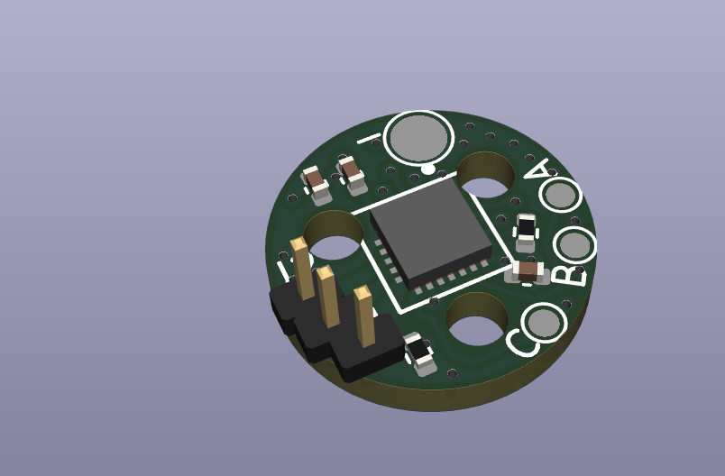

# Mighty Micro Motors
My goal with this project is to recreate the expensive and highly advanced motors typically found in big robots, such as in Boston Dynamics or MIT's robots, but at a **much** smaller scale. These are essentially tiny drone motors with a high reduction gearbox, a magnetic encoder, and a FOC controller board.

You can check out my project log [here](Progress%20Log.md).

This project is sponsored by [PCBWay](https://www.pcbway.com/)

## Gearbox
This has to be a resin printed or precision machined gearbox, just from the sheer smallness of everything. The brushless drone motors (HappyModel SE0802) are 10mm in diameter, so the gearbox ideally should be a similar size.

I'm currently thinking about having a cycloidal or split-ring planetary gearbox, due to the compact size and high reduction ratios

Preliminary CAD designs are on onshape, you can watch my progress here: [Mighty Micro Motors - Onshape](https://cad.onshape.com/documents/c861ec30af8169cf9c14bd7f/w/e538486c85e6a5fe77cd1d33/e/19bd07544dbaacbeb2fafd06). Step files and STL files will also be uploaded to this repo.

### Cycloidal 16-to-1 reduction:

Currently the design is twice as big as my ideal, with a 19mm diameter. I can not reduce the diameter without removing the bearings, possible reducing the lifespan. This *really* needs to be smaller, so I may do some testing and just remove some bearings. I'm not actually sure how well the 1x3x1mm bearings roll compared to just a smooth shaft. I could also cut the hole count down if the screws were also the shafts.

In real life:

### Split Ring Compound Planetary gearbox 74.66-to-1 reduction:

This goes by a variety of names, but basically this is a two-stage planetary gearbox, with the planets merged together. Due to some interesting mechanics, this type of gearbox can have **an extreme** reduction ratio in a relatively small size. The reduction ratio is the first stage ratio(ring teeth / sun teeth) multiplied by 2nd stage ring teeth, divided by the number of planets (simplified, this only works if both planet gear sets have the same number of teeth). The 2nd stage is advanced by a few teeth every revolution of the first. This operates on the same principle as a cycloidal drive and a harmonic drive, but with the added reduction ratio of the planetary gears, and without the vibration.

One thing to note with this type of gearbox is that the output encoder wires cannot fit through the center like my other gearbox, which limits the usable motion range to 270 degrees.

My particular version is a 74.66:1, in a much smaller form-factor than my cycloidal drive!

## Control board
### Version 1
My first version of the control board is designed to test all functions that may exist on a robot. I have the motor driver, a MCU for the algorithms, connectors for sensors (I2c and SPI), and a power management system.

A lot of care has been taken to design for EMI, which is why I have separate ground planes and have plotted current return paths for *most* traces. When I design a controller that supports 3+ motors I'm going to deal with length matching too on the low speed signals (Currently I'm testing all possible pin combinations, which doesn't lend itself to length matching). I'm still learning about good EMI design practices though, so there may be a big flaw in the design I don't see.

At it's current state the control PCB has been assembled and power tested. Nothing blew up or heated up, though I have discovered that the battery protection chip is not working. I will probably just bypass that circuit and move on.

[Schematic](Media/stm32g070%20and%20DRV8311%20single%20motor%20board%20-%20V1%20Alpha.pdf)

**Specs:**
- TI BQ25060 single-cell battery charger along with a BQ298012 battery protection chip. 
- 4 mosfets on board to control system power, 60+ amps of current
- TI DRV8311 motor driver, which can drive a brushless motor at 5 amps current (I fully expect heat problems due to the small size of the chip!)
- STM32G070CB, clocked at the max 64mhz (16mhz crystal scaled internally). 128kb mem, 64kb ram. The stm32 I chose is relatively inexpensive and *should be able to handle 3 motors*. (this was proven false later after testing other MCUs)

The motor driver section is 16x11mm, which hopefully is small enough and easily tileable for a small robot controller with lots of motors. The biggest part of the board is the power management, followed by the stm32.

**Ordering info**
The pcb is a 4 layer board, with 1 oz copper. Also, it is **strongly recommended** to order a stencil for both PCBs and to do a good job pasting the board. I fortunately ordered a stencil for the controller, but I put too much solder paste on and had to fix a lot of bridges after the fact. For the encoder board I manually pasted it, and that was a real pain to do a tiny QFN chip.

#### Tested functionality:
- Can be powered on without exploding
- 3.3v regulator on the motor chip works (though with a flaw that requires a kickstart to get it going)
- Can be programmed and flash an LED
- Can be clocked to a max 64mhz
- Power mosfet switching works on the charger
- Can communicate over SPI, UART and the debug interface
- Can drive a brushless drone motor at 10k rpm

#### Photos

Assembled:

(Note that I messed up on the mosfets I ordered which were too tiny. I have the correct mosfet specified now)

### Version 2
My second test control board has had a lot of the components switched, and actually split the DRV8311 onto a separate board.

I am testing a lot of the same functionality as last time, and its still a single motor system.

[Schematic](Kicad/esp32-s3%20single%20motor%20&%20battery%20controller/esp32-s3%20single%20motor%20&%20battery%20controller.pdf)

**Specs:**
- TI BQ24780S 2-cell battery charger along with a BQ276905 battery balancer, monitor, and protection chip. 
- 2 power mosfets on board to control system power, 60+ amps of current, 4 additional smaller mosfets for charging
- ESP32-S3 microcontroller, clocked at 240mhz and can support 4 motors (not in this version)
- TI DRV8311 controlling the motor, except on a separate PCB located on the back of the motor.
- 7 pin FPC connector for the V2 encoder

#### Photos

Off board controller

## Encoder board

This is a little magnetic board I designed to be attached to the end of the motor. It has a MA735 chip, which is low cost and seemed perfect for my needs. The resolution is inversely proportional to rotational reading speeds, so I will be fine no matter which end of the gearbox I stick it on. Low resolution on the high-speed end will mean I still have high resolution positioning on the output, and high resolution on the output side is fine because the output is slower.

The board is barely bigger than the jst sh connector on top for SPI communication! V2 of the board is mounted on a flex cable so it doesn't need wires.

The encoder chips datasheet recommends a diametrically magnetized 5x3mm neodymium magnet to operate. I used a 6x3mm from K&J magnetics: [D42DIA](https://www.kjmagnetics.com/proddetail.asp?prod=D42DIA).

## Sponsorship

Thanks to PCBWay for reaching out to sponsor my project. They kindly offered to allow me to test their pcb manufacturing capabilites with this project.

I liked the quality of the pcbs I received for the V2 boards, everything was soldered correctly with only minor burn marks on the through-hole components. The assembly service they offered was also top-notch, much easier than hand assembling at home. When I made a mistake on one of the PCB assemblies I ordered, they were quick to ask what should be done, and were willing to let me have the misplaced parts (sot-23 transitors instead of sot23-5) so I could fix it myself with some bodge wires. The one downside to PCBway is the cost of the boards, I would not normally pay for prototype pcbs at their prices.

Try them out if you haven't [https://www.pcbway.com/](https://www.pcbway.com/).

See the section **Version 2/Photos** above for pictures.

## Code
There is not that much code currently, just some tests to verify the board and motors work, and a programmer definition for my Flipper Zero. I am planning on using the wonderful [SimpleFOC](https://github.com/simplefoc/Arduino-FOC) library as a starting point for the motor control, building out my own communication protocol or going with ROS 2 style communication. I may also add some motor control algorithms as I discover more.

I have tuned the PID algorithms for my particular HappyModel SE0802 brushless drone motors.
