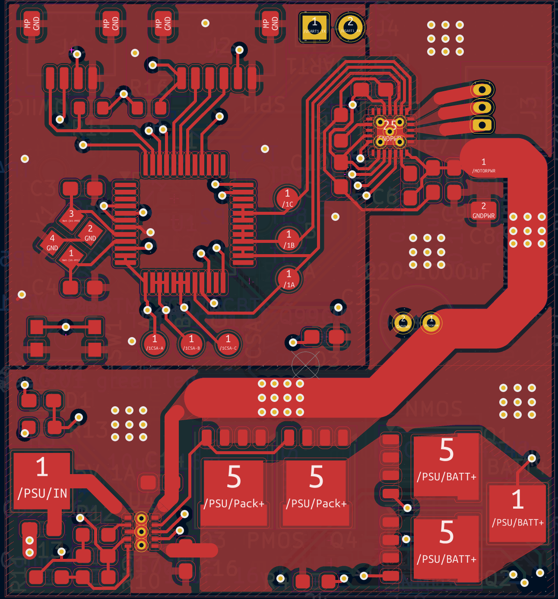
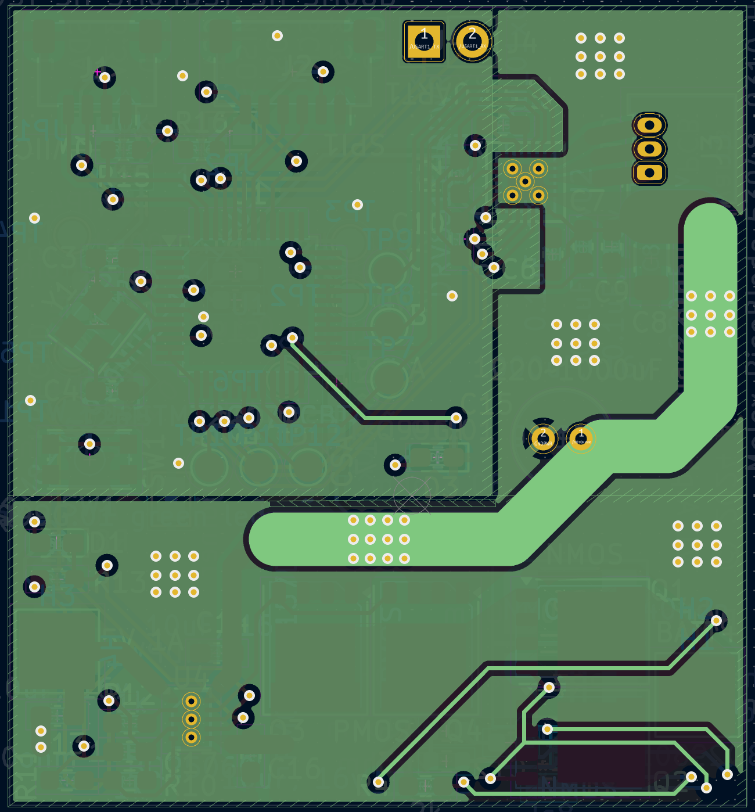
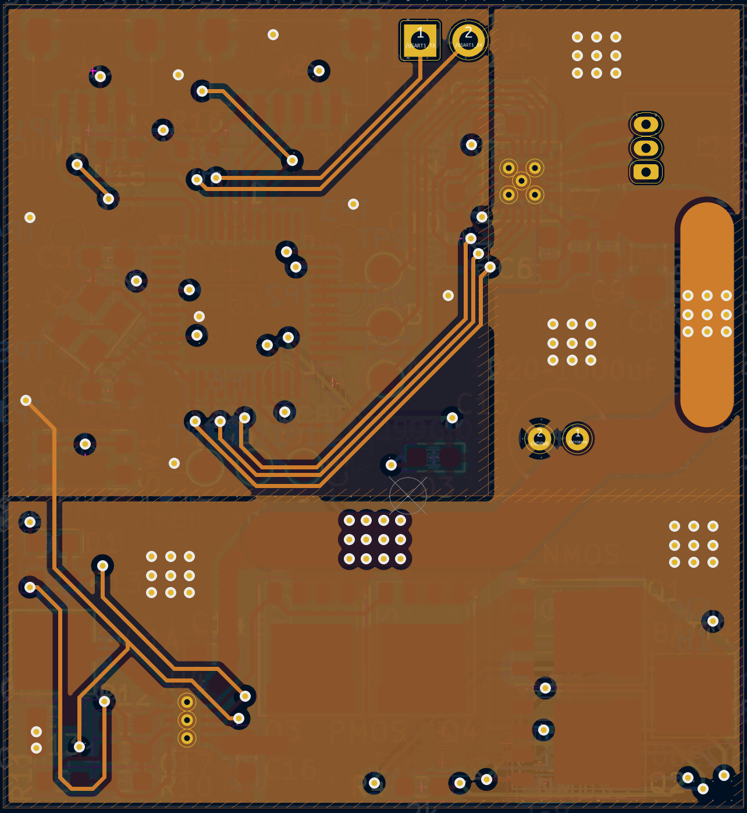
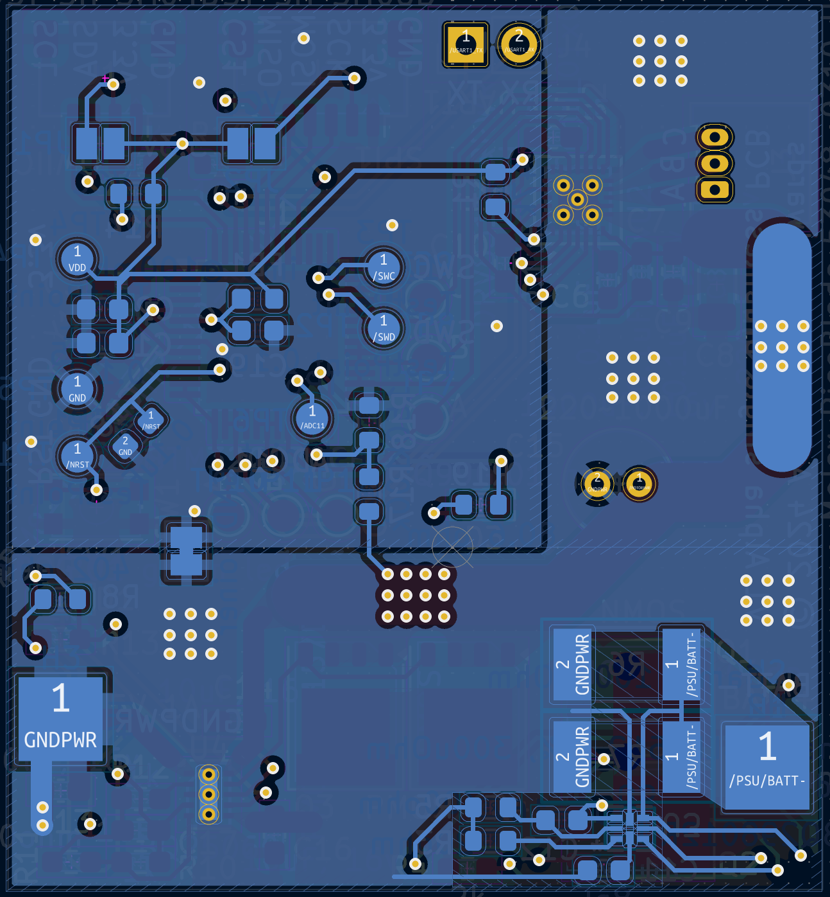

# Mighty Micro Motors
My goal with this project is to recreate the expensive and highly advanced motors typically found in big robots, such as in Boston Dynamics or MIT's robots, but at a **much** smaller scale. These are essentially tiny drone motors with a high reduction gearbox, a magnetic encoder, and a FOC controller.

You can check out my project log [here](Progress%20Log.md).

## Gearbox
This has to be a resin printed or precision machined gearbox, just from the sheer smallness of everything. The drone motors are 10mm in diameter, so the gearbox should be a similar size.

I'm currently thinking about having a cycloidal or split-ring planetary gearbox. 

Preliminary CAD designs are on onshape, you can watch my progress here: [Mighty Micro Motors - Onshape](https://cad.onshape.com/documents/c861ec30af8169cf9c14bd7f/w/e538486c85e6a5fe77cd1d33/e/19bd07544dbaacbeb2fafd06). Step files and STL files will also be uploaded to this repo.

## Control board
My first version of the control board is designed to test all functions that may exist on a robot. I have the motor driver, a MCU for the algorithms, connectors for sensors (I2c and SPI), and a power management system.

A lot of care has been taken to design for EMI, which is why I have separate ground planes and have plotted current return paths for *most* traces. When I design a controller that supports 3+ motors I'm going to deal with length matching too on the low speed signals (Currently I'm testing all possible pin combinations, which doesn't lend itself to length matching). I'm still learning about good EMI design practices though, so there may be a big flaw in the design I don't see.

At it's current state the control PCB has been assembled and power tested. Nothing blew up or heated up, though I have discovered that the battery protection chip is not working. I will probably just bypass that circuit and move on.

[Schematic](Media/stm32g070%20and%20DRV8311%20single%20motor%20board%20-%20V1%20Alpha.pdf)

**Specs:**
- TI BQ25060 single-cell battery charger along with a BQ298012 battery protection chip. 
- 4 mosfets on board to control system power, 60+ amps of current
- TI DRV8311 motor driver, which can drive a brushless motor at 5 amps current (I fully expect heat problems due to the small size of the chip!)
- STM32G070CB, clocked at the max 64mhz (16mhz crystal scaled internally). 128kb mem, 64kb ram. The stm32 I chose is relatively inexpensive and powerful, and can handle up 3 motors.

The motor driver section is 16x11mm, which hopefully is small enough and easily tileable for a small robot controller with lots of motors. The biggest part of the board is the power management, followed by the stm32.

**Ordering info**

I ordered my pcbs from JLCPCB, because they are inexpensive and can do advanced pcbs. 

The pcb is a 4 layer board, with 1 oz copper. The power trace is exposed for solder if extra conductivity is needed. Also, it is **strongly recommended** to order a stencil for both PCBs and to do a good job pasting the board. I fortunately ordered a stencil for the controller, but I put too much solder paste on and had to fix a lot of bridges after the fact. For the encoder board I manually pasted it, and that was a real pain to do a tiny QFN chip.

### Tested functionality:
- Can be powered on without exploding
- 3.3v regulator on the motor chip works (though with a flaw that requires a kickstart to get it going)
- Can be programmed and flash an LED
- Can be clocked to a max 64mhz
- Power mosfet switching works on the charger
- Can communicate over SPI, UART and the debug interface

### Photos

Assembled:

(Note that I messed up on the mosfets I ordered which were too tiny. I have the correct mosfet specified now)

## Encoder board

This is a little magnetic board I designed to be attached to the end of the motor. It has a MA735 chip, which is low cost and seemed perfect for my needs. The resolution is inversely proportional to rotational reading speeds, so I will be fine no matter which end of the gearbox I stick it on. Low resolution on the high-speed end will mean I still have high resolution positioning on the output, and high resolution on the output side is fine because the output is slower.

The board is barely bigger than the jst sh connector on top for SPI communication!

The encoder chips datasheet recommends a diametrically magnetized 5x3mm neodymium magnet to operate. I used a 6x3mm from K&J magnetics: [D42DIA](https://www.kjmagnetics.com/proddetail.asp?prod=D42DIA).

## Code
There is not that much code currently, just some tests to verify the board works, and a programmer definition for my Flipper Zero. I am planning on using the wonderful [SimpleFOC](https://github.com/simplefoc/Arduino-FOC) library as a starting point for the motor control, building out my own communication protocol or going with ROS 2 style communication. I may also add some motor control algorithms as I discover more.
